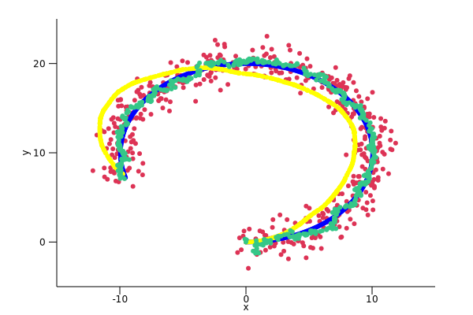
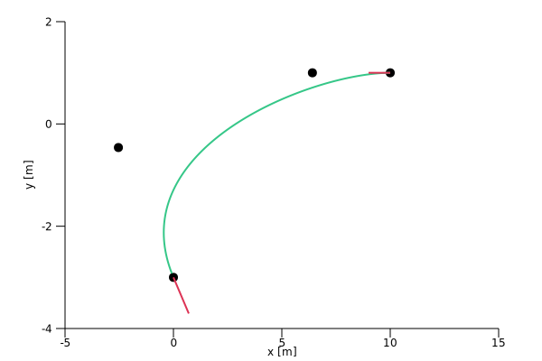
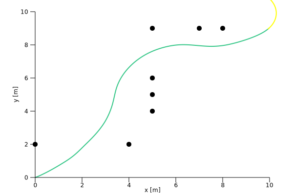
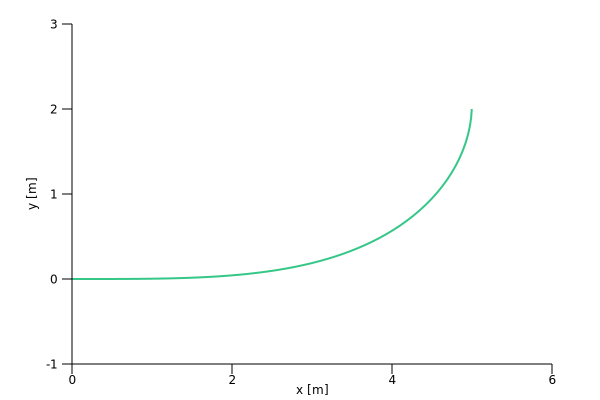
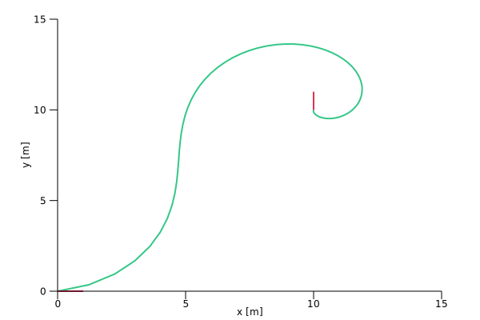
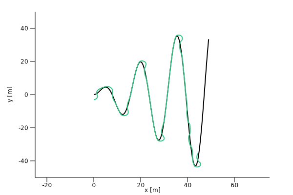
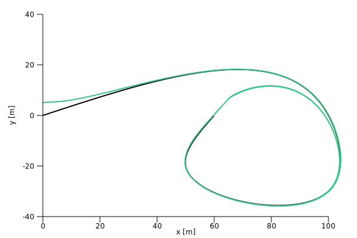

RustRobotics
====

This package is a rust implementation of [PythonRobotics](https://github.com/AtsushiSakai/PythonRobotics).

Build
```
git clone https://github.com/rsasaki0109/RustRobotics.git
cd RustRobotics
cargo build
```

Run (Example)
```
cargo run --bin ekf
```

# Table of Contents
   * [Localization](#localization)
      * [Extended kalman filter localization](#extended-kalman-filter-localization)
      * Particle filter localization
   * [SLAM](#slam)
      * Iterative Closest Point 
      * FastSLAM 1.0
   * [Path Planning](#path-planning)
      * [Bezier Path](#bezier-path)
      * [Cubic Spline](#cubic-spline)
      * [Dynamic Window Approach](#dynamic-window-approach)
      * [Model Predictive Trajectory Generator](#model-predictive-trajectory-generator)
      * Dijkstra algorithm
      * Potential Field algorithm
      * State Lattice Planner
      * Rapidly-Exploring Random Trees (RRT)
   * [Path Tracking](#path-tracking)
      * [Move to Pose](#move-to-pose)
      * [Pure Pursuit](#pure-pursuit)
      * [Stanley Control](#stanly-control)
      * [LQR steer control](#lqr-steer-control)
      * Nonlinear Model predictive control with C-GMRES

# Localization
## Extended Kalman Filter Localization

 


Red:GPS, Brue:Ground Truth, Green:EKF, Yellow:Dead Reckoning

- [src](https://github.com/rsasaki0109/RustRobotics/blob/master/src/bin/ekf.rs)

```
cargo run --bin ekf
```

## Particle Filter Localization

# SLAM
## Iterative Closest Point
## FastSLAM 1.0


# Path Planning
## Bezier Path

 

Brack:Control points, Green: Path, Red: Start and Goal

- [src](https://github.com/rsasaki0109/RustRobotics/blob/master/src/bin/bezier_path.rs)

```
cargo run --bin bezier_path
```

## Cubic Spline


  

Brack:Control points, Green: Path

- [src](https://github.com/rsasaki0109/RustRobotics/blob/master/src/cubic_spline_planner.rs)

```
cargo run --bin csp
```


## Dynamic Window Approach

  

Brack: Obstacles, Green: Trajectry, Yellow: Predected trajectry

- [src](https://github.com/rsasaki0109/RustRobotics/blob/master/src/bin/dwa.rs)

```
cargo run --bin dwa
```

## Model Predictive Trajectory Generator

  

Green: Path 

- [src](https://github.com/rsasaki0109/RustRobotics/blob/master/src/bin/model_predictive_trajectory_generator.rs)


```
cargo run --bin model_predictive_trajectory_generator
```

## Dijkstra algorithm
## Potential Field algorithm
## State Lattice Planner
## Rapidly-Exploring Random Trees

# Path Tracking
## Move to Pose 
  

Green: Path, Red: Start and Goal

- [src](https://github.com/rsasaki0109/RustRobotics/blob/master/src/bin/move_to_pose.rs)

```
cargo run --bin move_to_pose
```

## Pure Pursuit

  

Brack: Planned path, Green: Tracked path 

- [src](https://github.com/rsasaki0109/RustRobotics/blob/master/src/bin/pure_pursuit.rs)


```
cargo run --bin pure_pursuit
```

## Stanly Control 

  

Brack: Planned path, Green: Tracked path 

- [src](https://github.com/rsasaki0109/RustRobotics/blob/master/src/bin/stanley_controller.rs)


```
cargo run --bin stanley_control
```


## LQR steer control

  

Brack: Planned path, Green: Tracked path 

- [src](https://github.com/rsasaki0109/RustRobotics/blob/master/src/bin/lqr_steer_control.rs)


```
cargo run --bin lqr_steer_control
```

## Nonlinear Model predictive control with C-GMRES


