RustRobotics
====

This package is a rust implementation of [PythonRobotics](https://github.com/AtsushiSakai/PythonRobotics).

Build
```
git clone https://github.com/rsasaki0109/RustRobotics.git
cd RustRobotics
cargo build
```

Run (Example)
```
cargo run --bin a_star
cargo run --bin rrt
cargo run --bin inverted_pendulum_lqr
cargo run --bin two_joint_arm_control
```

# Table of Contents
   * [Localization](#localization)
      * [Extended Kalman Filter Localization](#extended-kalman-filter-localization)
      * [Particle Filter Localization](#particle-filter-localization)
      * [Unscented Kalman Filter Localization](#unscented-kalman-filter-localization)
   * [Mapping](#mapping)
      * [NDT Map](#ndt-map)
   * [SLAM](#slam)
      * Iterative Closest Point
      * FastSLAM 1.0
   * [Path Planning](#path-planning)
      * [A* Algorithm](#a-algorithm)
      * [Bezier Path](#bezier-path)
      * [Bezier Path Planning](#bezier-path-planning)
      * [Cubic Spline](#cubic-spline)
      * [Dynamic Window Approach](#dynamic-window-approach)
      * [Dijkstra Algorithm](#dijkstra-algorithm)
      * [Informed RRT*](#informed-rrt)
      * [Model Predictive Trajectory Generator](#model-predictive-trajectory-generator)
      * [Potential Field Algorithm](#potential-field-algorithm)
      * [Quintic Polynomials](#quintic-polynomials)
      * [Rapidly-Exploring Random Trees (RRT)](#rapidly-exploring-random-trees-rrt)
      * [RRT*](#rrt)
      * [Reeds-Shepp Path](#reeds-shepp-path)
      * State Lattice Planner
   * [Path Tracking](#path-tracking)
      * [LQR Steer Control](#lqr-steer-control)
      * [Move to Pose](#move-to-pose)
      * [Pure Pursuit](#pure-pursuit)
      * [Stanley Control](#stanley-control)
      * Nonlinear Model predictive control with C-GMRES
   * [Inverted Pendulum](#inverted-pendulum)
      * [LQR Control](#lqr-control)
      * [MPC Control](#mpc-control)
   * [Arm Navigation](#arm-navigation)
      * [Two Joint Arm Control](#two-joint-arm-control)

# Localization
## Extended Kalman Filter Localization


Red:GPS, Brue:Ground Truth, Green:EKF, Yellow:Dead Reckoning

- [src](https://github.com/rsasaki0109/RustRobotics/blob/master/src/bin/ekf.rs)

```
cargo run --bin ekf
```

## Particle Filter Localization

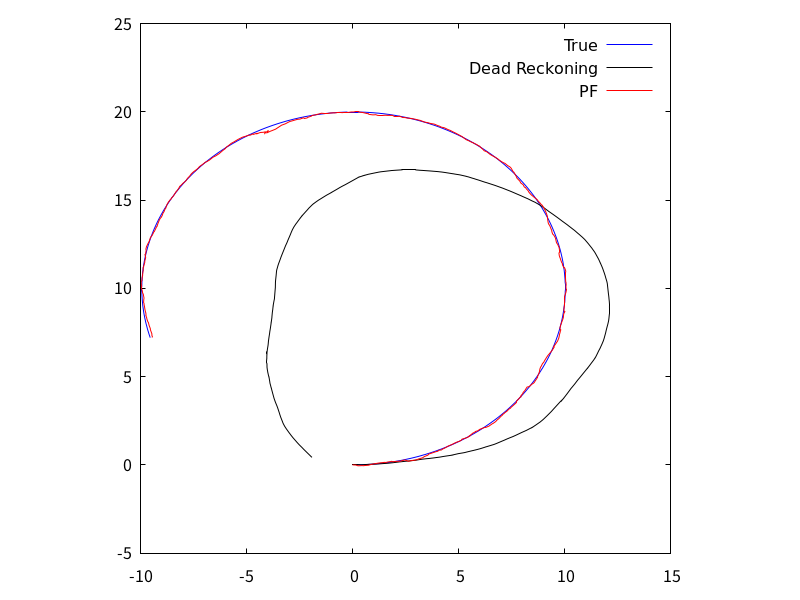

Blue: GPS, Red: Ground Truth, Green: Particle Filter, Yellow: Dead Reckoning

- [src](./src/localization/particle_filter.rs)

```
cargo run --bin particle_filter
```

## Unscented Kalman Filter Localization

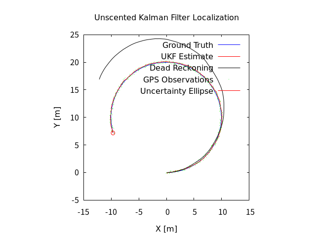

Blue: Ground Truth, Red: UKF Estimate, Black: Dead Reckoning, Green: GPS Observations, Red Ellipse: Uncertainty

- [src](./src/localization/unscented_kalman_filter.rs)

```
cargo run --bin unscented_kalman_filter
```

# Mapping
## NDT Map

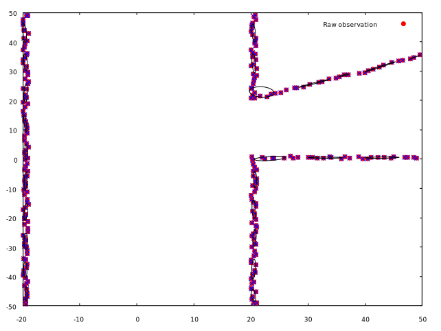

- [src](./src/mapping/ndt.rs)

```
cargo run --bin ndt
```

# SLAM

## Iterative Closest Point (ICP) Matching

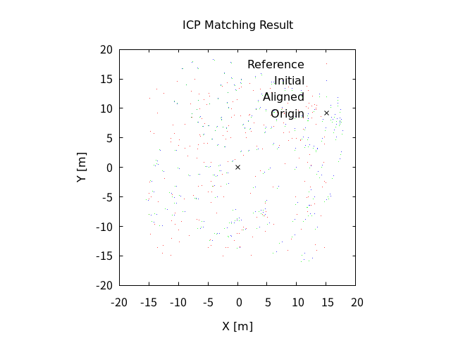

Red: Reference points, Blue: Initial points, Green: Aligned points

- [src](./src/slam/icp_matching.rs)

```
cargo run --bin icp_matching
```

## FastSLAM 1.0


# Path Planning

## A* Algorithm

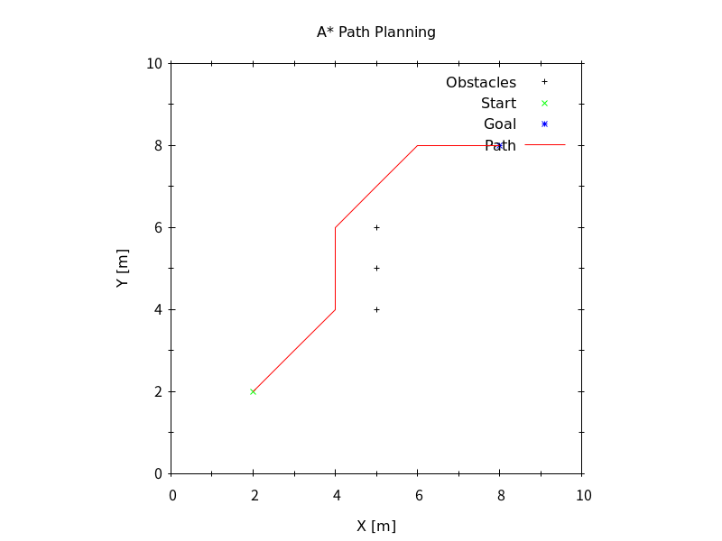

Blue: Start, Red: Goal, Green: Path, Gray: Obstacles

- [src](./src/path_planning/a_star.rs)

```
cargo run --bin a_star
```

## Bezier Path

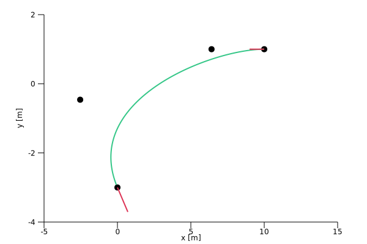

Black: Control points, Green: Path, Red: Start and Goal

- [src](./src/path_planning/bezier_path.rs)

```
cargo run --bin bezier_path
```

## Bezier Path Planning

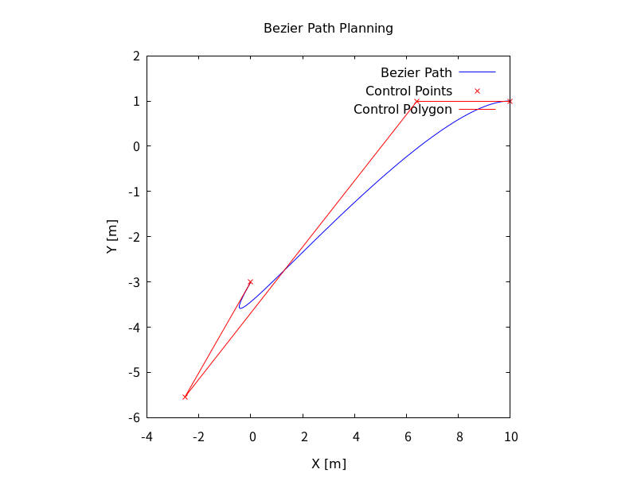

Blue: Start, Red: Goal, Green: Path

- [src](./src/path_planning/bezier_path_planning.rs)

```
cargo run --bin bezier_path_planning
```

## Cubic Spline

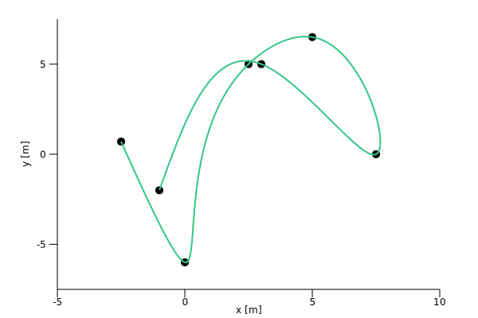

Black: Control points, Green: Path

- [src](./src/path_planning/csp.rs)

```
cargo run --bin csp
```

## Dynamic Window Approach

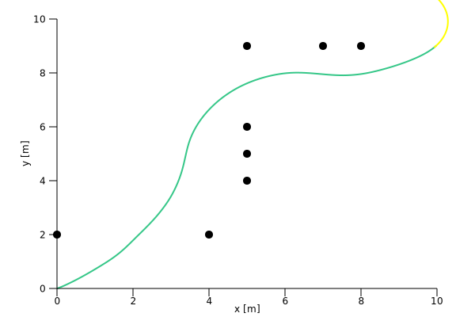

Black: Obstacles, Green: Trajectory, Yellow: Predicted trajectory

- [src](./src/path_planning/dwa.rs)

```
cargo run --bin dwa
```

## Dijkstra Algorithm

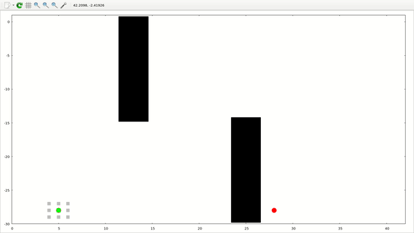

- [src](./src/path_planning/dijkstra.rs)

```
cargo run --bin dijkstra
```

## Informed RRT*

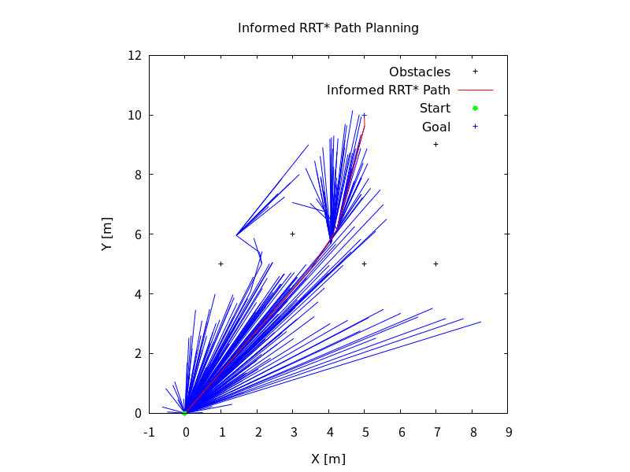

Blue: Start, Red: Goal, Green: Path, Black: Tree

- [src](./src/path_planning/informed_rrt_star.rs)

```
cargo run --bin informed_rrt_star
```

## Model Predictive Trajectory Generator

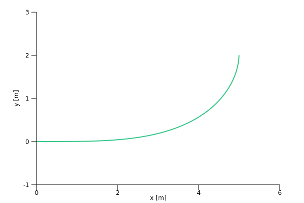

Green: Path

- [src](./src/path_tracking/model_predictive_trajectory_generator.rs)

```
cargo run --bin model_predictive_trajectory_generator
```

## Potential Field Algorithm

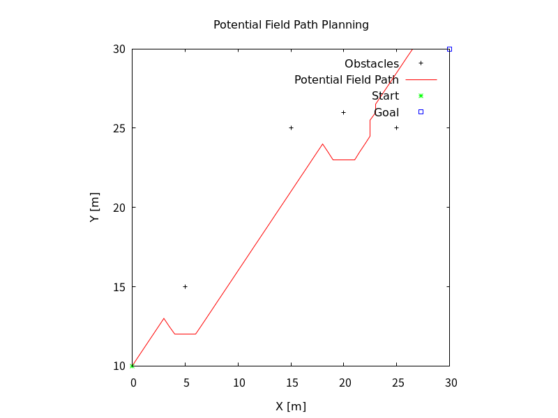

Blue: Start, Red: Goal, Green: Path, Gray: Obstacles

- [src](./src/path_planning/potential_field.rs)

```
cargo run --bin potential_field
```

## Quintic Polynomials

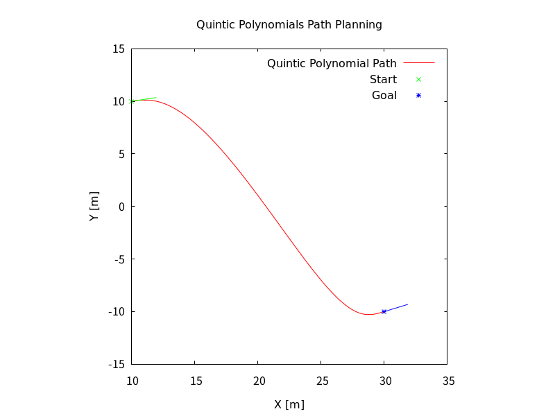

Blue: Start, Red: Goal, Green: Path

- [src](./src/path_planning/quintic_polynomials.rs)

```
cargo run --bin quintic_polynomials
```

## Rapidly-Exploring Random Trees (RRT)


Blue: Start, Red: Goal, Green: Path, Black: Tree

- [src](./src/path_planning/rrt.rs)

```
cargo run --bin rrt
```

## RRT*


Blue: Start, Red: Goal, Green: Path, Black: Tree

- [src](./src/path_planning/rrt_star.rs)

```
cargo run --bin rrt_star
```

## Reeds-Shepp Path

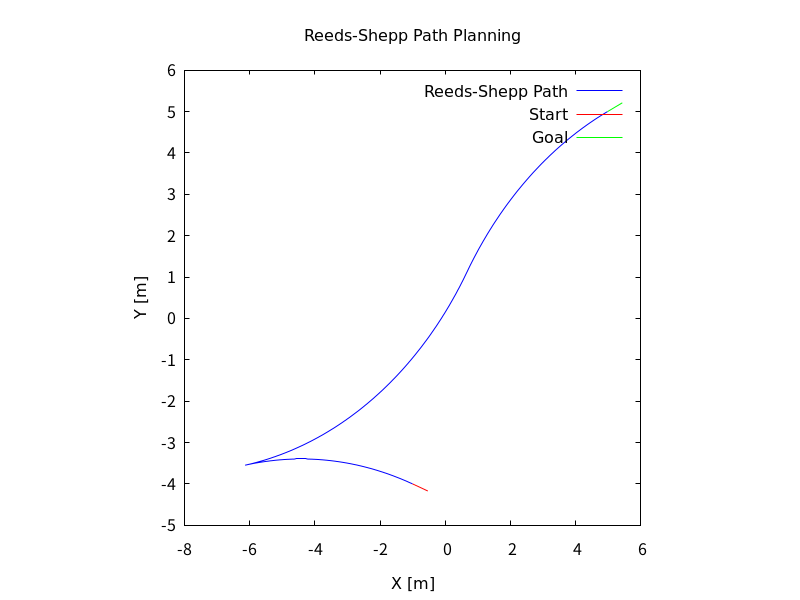

Blue: Start, Red: Goal, Green: Path

- [src](./src/path_planning/reeds_shepp_path.rs)

```
cargo run --bin reeds_shepp_path
```

## State Lattice Planner

# Path Tracking

## LQR Steer Control

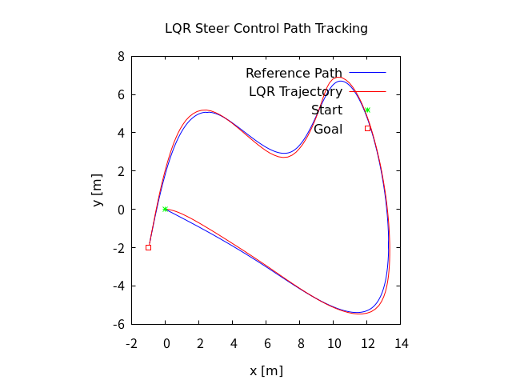

Black: Planned path, Green: Tracked path

- [src](./src/path_tracking/lqr_steer_control.rs)

```
cargo run --bin lqr_steer_control
```

## Move to Pose


Green: Path, Red: Start and Goal

- [src](./src/path_tracking/move_to_pose.rs)

```
cargo run --bin move_to_pose
```

## Pure Pursuit

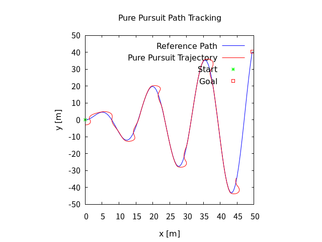

Black: Planned path, Green: Tracked path

- [src](./src/path_tracking/pure_pursuit.rs)

```
cargo run --bin pure_pursuit
```

## Stanley Control

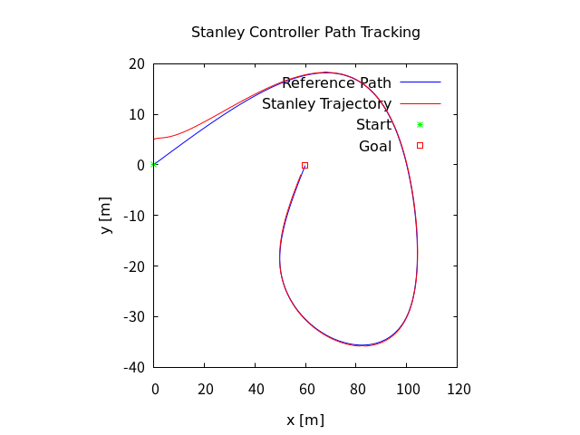

Black: Planned path, Green: Tracked path

- [src](./src/path_tracking/stanley_controller.rs)

```
cargo run --bin stanley_controller
```

## Nonlinear Model predictive control with C-GMRES

# Inverted Pendulum

## LQR Control

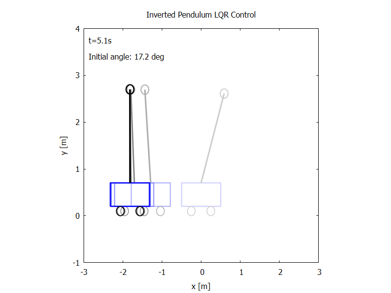

Blue: Position, Red: Angle

- [src](./src/inverted_pendulum/lqr_control.rs)

```
cargo run --bin inverted_pendulum_lqr
```

## MPC Control

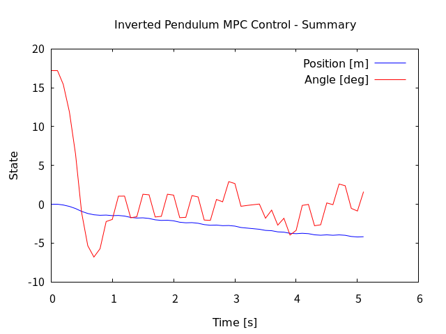

Blue: Position, Red: Angle with MPC prediction

- [src](./src/inverted_pendulum/mpc_control.rs)

```
cargo run --bin inverted_pendulum_mpc
```

# Arm Navigation

## Two Joint Arm Control

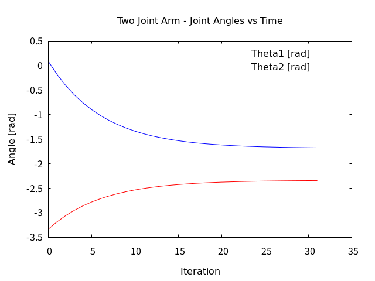

Blue: Theta1, Red: Theta2 joint angles over time

- [src](./src/arm_navigation/two_joint_arm_control.rs)

```
cargo run --bin two_joint_arm_control
```

# Mission Planning

## State Machine

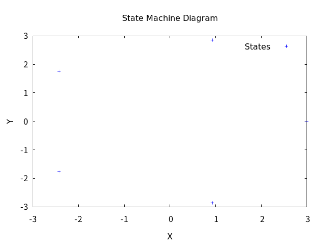

Finite state machine for robot behavior management with states, transitions, guards, and actions

- [src](./src/mission_planning/state_machine.rs)

```
cargo run --bin state_machine
```


