RustRobotics
====

GitHub Pages Showcase: https://rsasaki0109.github.io/rust_robotics/

This package is a rust implementation of [PythonRobotics](https://github.com/AtsushiSakai/PythonRobotics).

## Build

```bash
git clone https://github.com/rsasaki0109/RustRobotics.git
cd RustRobotics
cargo build --workspace
cargo test --workspace
```

## Workspace Structure

```
crates/
├── rust_robotics_core/          — Core types, traits, errors
├── rust_robotics_planning/      — Path planning (A*, DWA, RRT, PRM, etc.)
├── rust_robotics_localization/  — Localization (EKF, UKF, PF, Histogram)
├── rust_robotics_control/       — Control & path tracking (Pure Pursuit, LQR, MPC, etc.)
├── rust_robotics_mapping/       — Mapping (NDT, Gaussian Grid, Ray Casting)
├── rust_robotics_slam/          — SLAM (EKF-SLAM, FastSLAM, Graph SLAM, ICP)
├── rust_robotics_viz/           — Visualization (gnuplot wrapper)
└── rust_robotics/               — Umbrella crate (feature-gated re-exports)
```

## Usage as Library

```toml
# Use the full library
[dependencies]
rust_robotics = "0.1"

# Or use individual crates
[dependencies]
rust_robotics_planning = "0.1"
rust_robotics_localization = "0.1"
```

Types are re-exported at the crate root for convenience:

```rust
use rust_robotics_planning::{AStarPlanner, AStarConfig, DWAPlanner};
use rust_robotics_localization::{EKFConfig, EKFLocalizer};
use rust_robotics_control::{PurePursuitController, StanleyController};
```

## Run (Example)

```bash
# Headless (no GUI dependencies)
cargo run -p rust_robotics --example headless_grid_planners --features planning
cargo run -p rust_robotics --example headless_localizers --features localization
cargo run -p rust_robotics --example headless_navigation_loop --features "planning,localization,control"

# Visualization (requires gnuplot)
cargo run -p rust_robotics --example a_star --features "planning,viz"
cargo run -p rust_robotics --example jps --features "planning,viz"
cargo run -p rust_robotics --example rear_wheel_feedback --features "control,viz"
```

## Benchmarks

```bash
cargo bench -p rust_robotics_planning --bench grid_planners
```

# Table of Contents
   * [Localization](#localization)
      * [Extended Kalman Filter Localization](#extended-kalman-filter-localization)
      * [Particle Filter Localization](#particle-filter-localization)
      * [Unscented Kalman Filter Localization](#unscented-kalman-filter-localization)
      * [Histogram Filter Localization](#histogram-filter-localization)
   * [Mapping](#mapping)
      * [NDT Map](#ndt-map)
      * [Gaussian Grid Map](#gaussian-grid-map)
      * [Ray Casting Grid Map](#ray-casting-grid-map)
   * [SLAM](#slam)
      * [Iterative Closest Point](#iterative-closest-point-icp-matching)
      * [FastSLAM 1.0](#fastslam-10)
      * [EKF SLAM](#ekf-slam)
      * [Graph-Based SLAM](#graph-based-slam)
   * [Path Planning](#path-planning)
      * [A* Algorithm](#a-algorithm)
      * [Theta* Algorithm](#theta-algorithm)
      * [Jump Point Search (JPS)](#jump-point-search-jps)
      * [Bezier Path Planning](#bezier-path-planning)
      * [Cubic Spline](#cubic-spline)
      * [D* Lite](#d-lite)
      * [Dynamic Window Approach](#dynamic-window-approach)
      * [Dijkstra Algorithm](#dijkstra-algorithm)
      * [Informed RRT*](#informed-rrt)
      * [Model Predictive Trajectory Generator](#model-predictive-trajectory-generator)
      * [Potential Field Algorithm](#potential-field-algorithm)
      * [Quintic Polynomials](#quintic-polynomials)
      * [Rapidly-Exploring Random Trees (RRT)](#rapidly-exploring-random-trees-rrt)
      * [RRT*](#rrt)
      * [Reeds-Shepp Path](#reeds-shepp-path)
      * [PRM (Probabilistic Road-Map)](#prm-probabilistic-road-map)
      * [Voronoi Road-Map](#voronoi-road-map)
      * [Frenet Optimal Trajectory](#frenet-optimal-trajectory)
      * [State Lattice Planner](#state-lattice-planner)
   * [Path Tracking](#path-tracking)
      * [LQR Steer Control](#lqr-steer-control)
      * [Move to Pose](#move-to-pose)
      * [Pure Pursuit](#pure-pursuit)
      * [Stanley Control](#stanley-control)
      * [Rear Wheel Feedback Control](#rear-wheel-feedback-control)
      * [MPC (Model Predictive Control)](#mpc-model-predictive-control)
   * [Inverted Pendulum](#inverted-pendulum)
      * [LQR Control](#lqr-control)
   * [Arm Navigation](#arm-navigation)
      * [Two Joint Arm Control](#two-joint-arm-control)
   * [Aerial Navigation](#aerial-navigation)
      * [3D Grid A*](#3d-grid-a)
   * [Mission Planning](#mission-planning)
      * [Behavior Tree](#behavior-tree)
      * [State Machine](#state-machine)

# Localization
## Extended Kalman Filter Localization

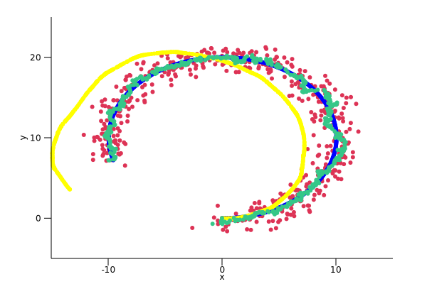


Red:GPS, Brue:Ground Truth, Green:EKF, Yellow:Dead Reckoning

- [src](./crates/rust_robotics_localization/src/ekf.rs)

```
cargo run -p rust_robotics --example ekf
```

## Particle Filter Localization

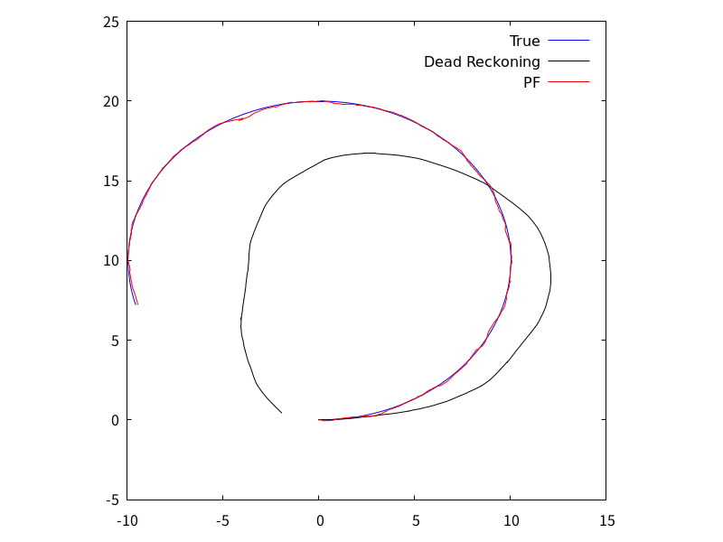

Blue: GPS, Red: Ground Truth, Green: Particle Filter, Yellow: Dead Reckoning

- [src](./crates/rust_robotics_localization/src/particle_filter.rs)

```
cargo run -p rust_robotics --example particle_filter
```

## Unscented Kalman Filter Localization

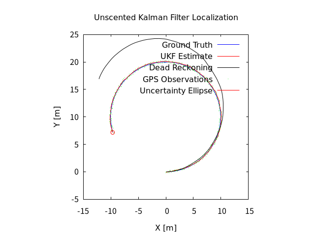

Blue: Ground Truth, Red: UKF Estimate, Black: Dead Reckoning, Green: GPS Observations, Red Ellipse: Uncertainty

- [src](./crates/rust_robotics_localization/src/unscented_kalman_filter.rs)

```
cargo run -p rust_robotics --example unscented_kalman_filter
```

## Histogram Filter Localization

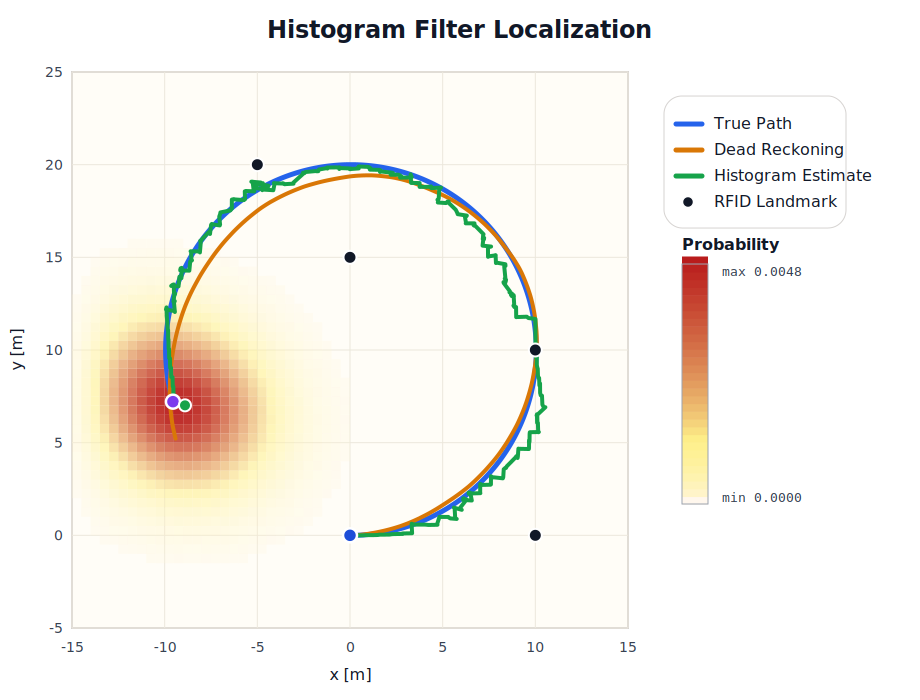

Grid-based probabilistic localization using RFID landmarks. The algorithm maintains a probability distribution over a 2D grid and updates it based on motion and observations.

Blue: True path, Orange: Dead Reckoning, Green: Histogram Filter estimate, Black: RFID landmarks

- [src](./crates/rust_robotics_localization/src/histogram_filter.rs)

```
cargo run -p rust_robotics --example histogram_filter
```

# Mapping
## NDT Map

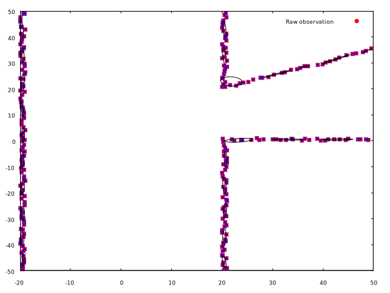

- [src](./crates/rust_robotics_mapping/src/ndt.rs)

```
cargo run -p rust_robotics --example ndt
```

## Gaussian Grid Map

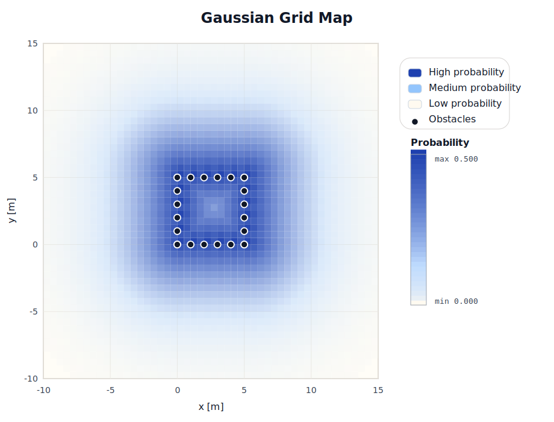

Occupancy grid mapping using Gaussian distribution. Higher probability near obstacles.

- [src](./crates/rust_robotics_mapping/src/gaussian_grid_map.rs)

```
cargo run -p rust_robotics --example gaussian_grid_map
```

## Ray Casting Grid Map

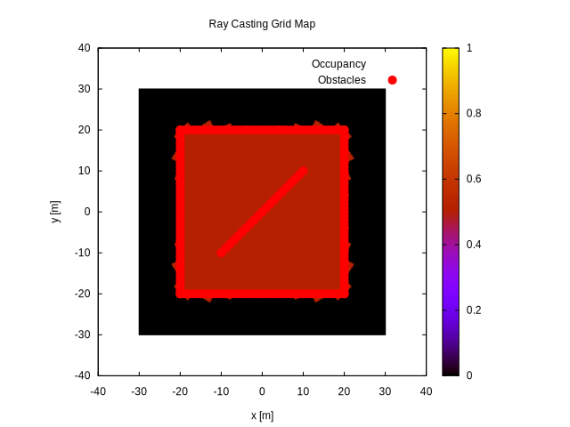

Occupancy grid mapping using ray casting. Free space (0.5), Occupied (1.0), Unknown (0.0).

- [src](./crates/rust_robotics_mapping/src/ray_casting_grid_map.rs)

```
cargo run -p rust_robotics --example ray_casting_grid_map
```

# SLAM

## Iterative Closest Point (ICP) Matching

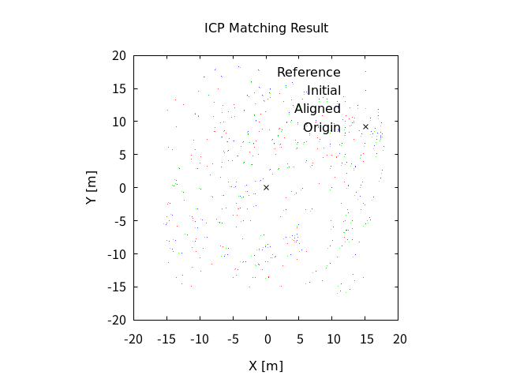

Red: Reference points, Blue: Initial points, Green: Aligned points

- [src](./crates/rust_robotics_slam/src/icp_matching.rs)

```
cargo run -p rust_robotics --example icp_matching
```

## FastSLAM 1.0

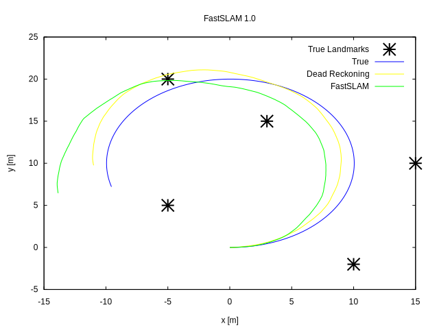

Particle filter based SLAM (Simultaneous Localization and Mapping). Each particle maintains its own map of landmarks using EKF.

Blue: True path, Yellow: Dead Reckoning, Green: FastSLAM estimate, Black: True landmarks, Cyan: Estimated landmarks

- [src](./crates/rust_robotics_slam/src/fastslam1.rs)

```
cargo run -p rust_robotics --example fastslam1
```

## EKF SLAM

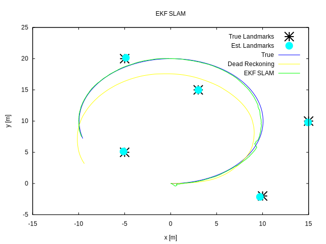

Extended Kalman Filter based SLAM. Maintains a joint state vector of robot pose and landmark positions with full covariance matrix.

- [src](./crates/rust_robotics_slam/src/ekf_slam.rs)

```
cargo run -p rust_robotics --example ekf_slam
```

## Graph-Based SLAM

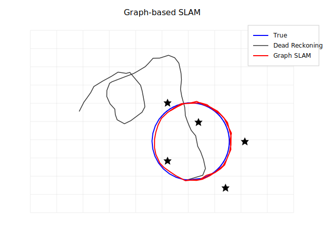

Pose graph optimization for SLAM. Constructs a graph of robot poses connected by odometry and observation constraints, then optimizes the graph using iterative methods.

- [src](./crates/rust_robotics_slam/src/graph_based_slam.rs)

```
cargo run -p rust_robotics --example graph_based_slam
```

# Path Planning

## A* Algorithm

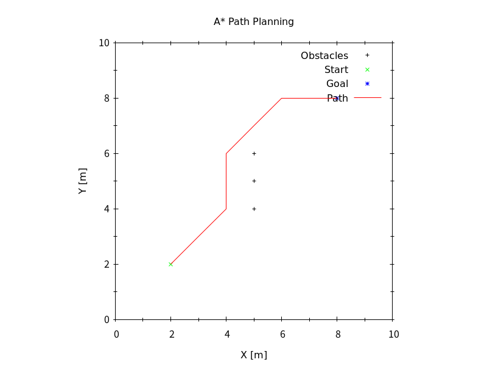

Blue: Start, Red: Goal, Green: Path, Gray: Obstacles

- [src](./crates/rust_robotics_planning/src/a_star.rs)

```
cargo run -p rust_robotics --example a_star
```

## Theta* Algorithm

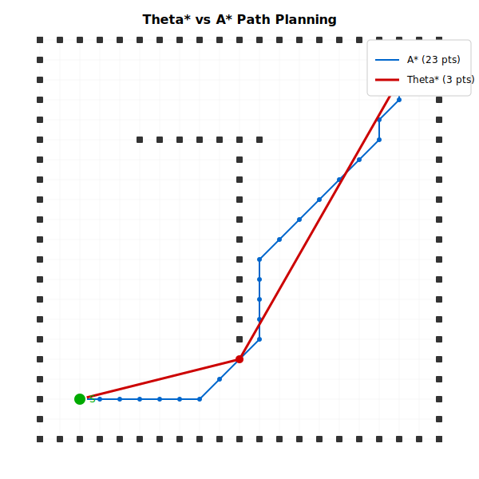

Any-angle path planning algorithm. Unlike A* which restricts movement to grid edges, Theta* allows paths at any angle by checking line-of-sight between nodes.

- [src](./crates/rust_robotics_planning/src/theta_star.rs)

```
cargo run -p rust_robotics --example theta_star
```

## Jump Point Search (JPS)

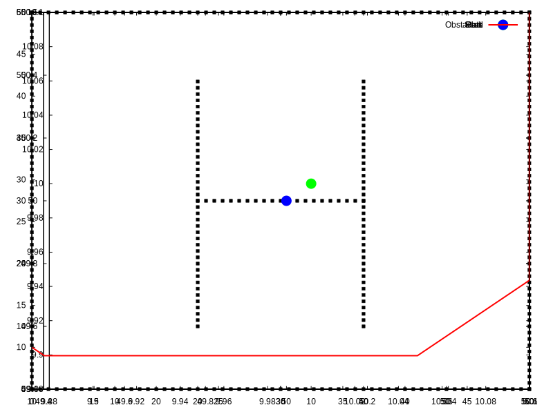

Optimized pathfinding algorithm for uniform-cost grids. Reduces the number of nodes to explore by identifying and jumping to key "jump points" instead of examining all neighbors.

- [src](./crates/rust_robotics_planning/src/jps.rs)

```
cargo run -p rust_robotics --example jps
```

## Bezier Path Planning

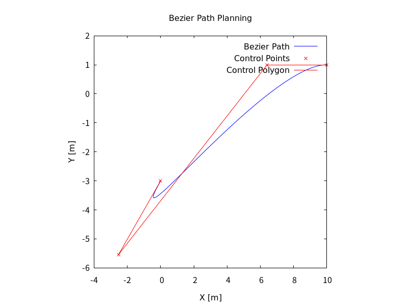

Blue: Start, Red: Goal, Green: Path

- [src](./crates/rust_robotics_planning/src/bezier_path_planning.rs)

```
cargo run -p rust_robotics --example bezier_planning
```

## Cubic Spline

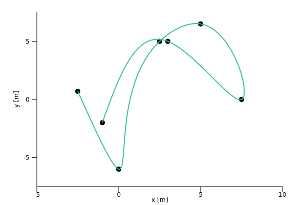

Black: Control points, Green: Path

- [src](./crates/rust_robotics_planning/src/cubic_spline_planner.rs)

```
cargo run -p rust_robotics --example csp
```

## Dynamic Window Approach

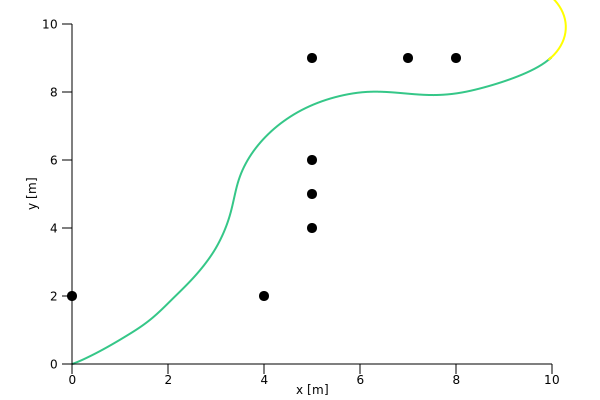

Black: Obstacles, Green: Trajectory, Yellow: Predicted trajectory

- [src](./crates/rust_robotics_planning/src/dwa.rs)

```
cargo run -p rust_robotics --example dwa
```

## D* Lite

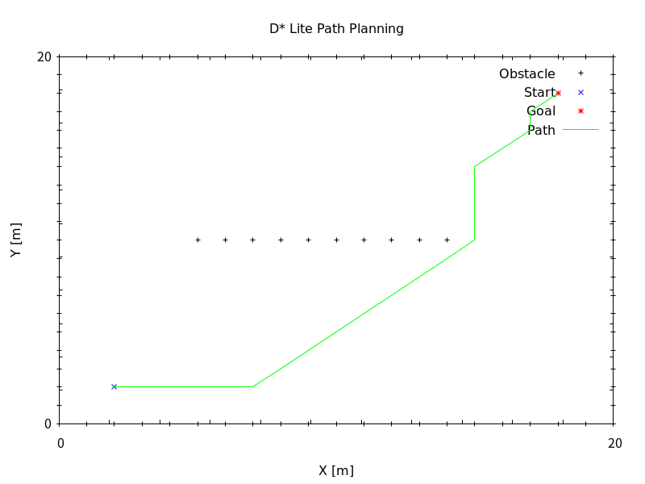

Blue: Start, Red: Goal, Green: Path, Black: Obstacles

- [src](./crates/rust_robotics_planning/src/d_star_lite.rs)

```bash
cargo run -p rust_robotics --example d_star_lite
```

D* Lite is an incremental heuristic search algorithm for path planning in dynamic environments. It's particularly efficient for replanning when the environment changes.

## Dijkstra Algorithm

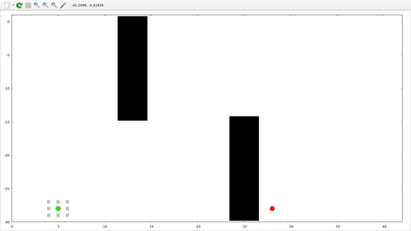

- [src](./crates/rust_robotics_planning/src/dijkstra.rs)

```
cargo run -p rust_robotics --example dijkstra
```

## Informed RRT*

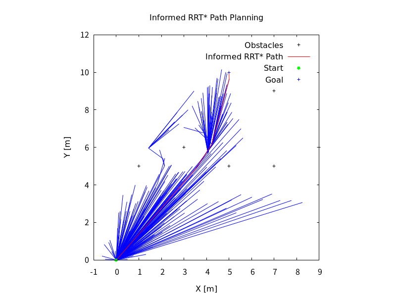

Blue: Start, Red: Goal, Green: Path, Black: Tree

- [src](./crates/rust_robotics_planning/src/informed_rrt_star.rs)

```
cargo run -p rust_robotics --example informed_rrt_star
```

## Model Predictive Trajectory Generator

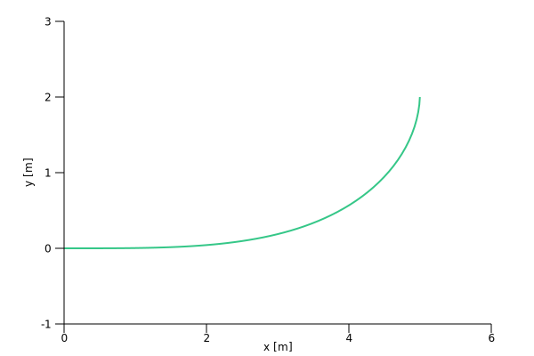

Green: Path

- [src](./crates/rust_robotics_control/src/model_predictive_trajectory_generator.rs)

```
cargo run -p rust_robotics --example model_predictive_trajectory_generator
```

## Potential Field Algorithm

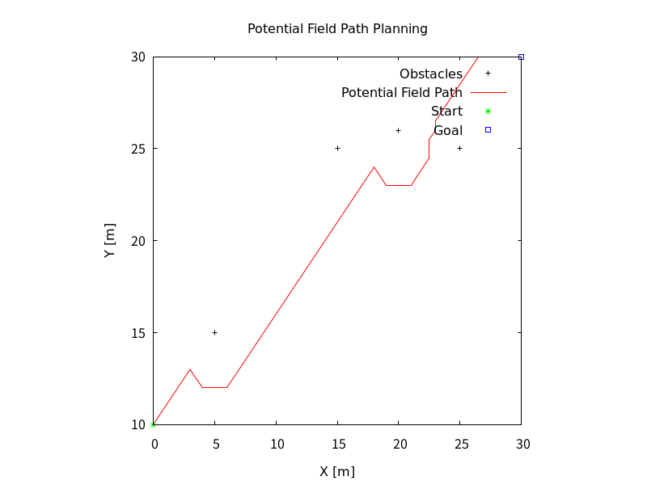

Blue: Start, Red: Goal, Green: Path, Gray: Obstacles

- [src](./crates/rust_robotics_planning/src/potential_field.rs)

```
cargo run -p rust_robotics --example potential_field
```

## Quintic Polynomials

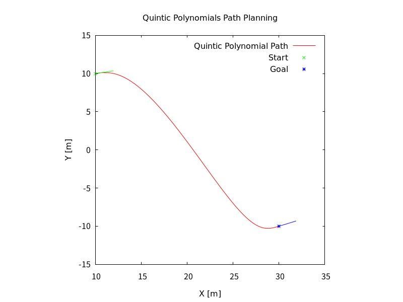

Blue: Start, Red: Goal, Green: Path

- [src](./crates/rust_robotics_planning/src/quintic_polynomials.rs)

```
cargo run -p rust_robotics --example quintic_polynomials
```

## Rapidly-Exploring Random Trees (RRT)

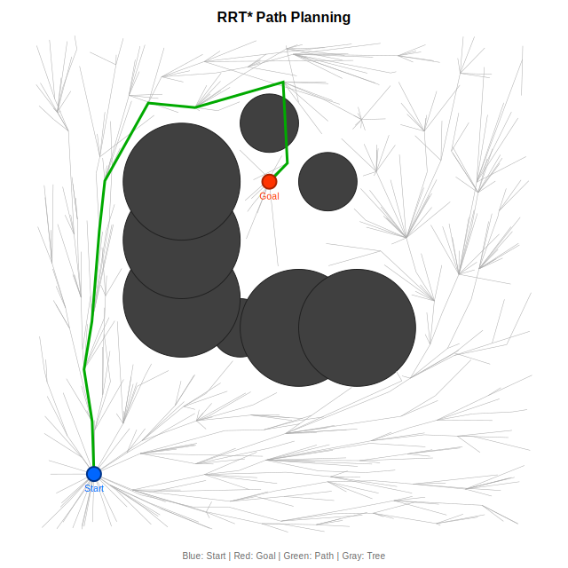

Sampling-based path planning algorithm that builds a tree by randomly sampling the configuration space.

Blue: Start, Red: Goal, Green: Path, Gray: Tree

- [src](./crates/rust_robotics_planning/src/rrt.rs)

```
cargo run -p rust_robotics --example rrt
```

## RRT*


Optimized version of RRT that rewires the tree to find shorter paths. Asymptotically optimal.

Blue: Start, Red: Goal, Green: Path, Gray: Tree

- [src](./crates/rust_robotics_planning/src/rrt_star.rs)

```
cargo run -p rust_robotics --example rrt_star
```

## Reeds-Shepp Path

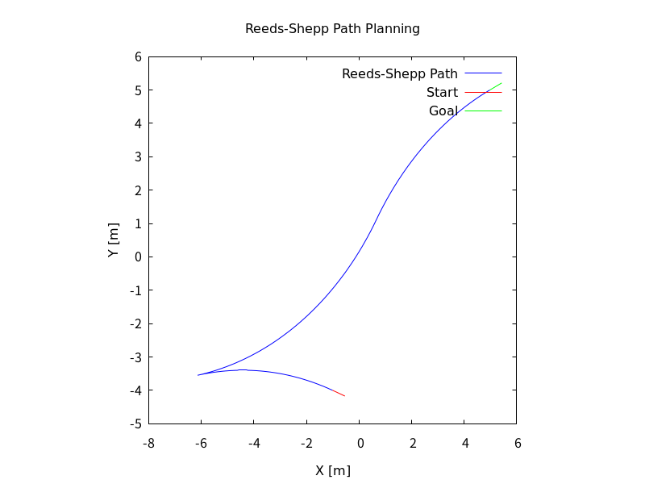

Blue: Start, Red: Goal, Green: Path

- [src](./crates/rust_robotics_planning/src/reeds_shepp_path.rs)

```
cargo run -p rust_robotics --example reeds_shepp
```

## PRM (Probabilistic Road-Map)

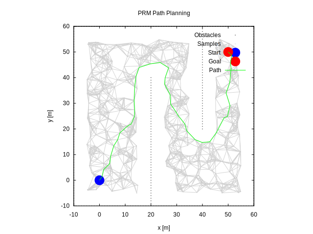

Sampling-based path planning using random samples and k-nearest neighbor connections.

Blue: Start, Red: Goal, Green: Path, Gray: Samples and edges, Black: Obstacles

- [src](./crates/rust_robotics_planning/src/prm.rs)

```
cargo run -p rust_robotics --example prm
```

## Voronoi Road-Map

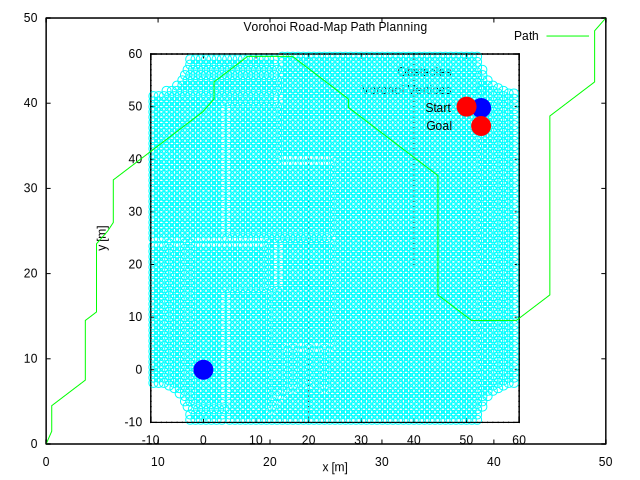

Path planning using Voronoi diagram vertices as waypoints. Provides paths that maximize clearance from obstacles.

Blue: Start, Red: Goal, Green: Path, Cyan: Voronoi vertices, Black: Obstacles

- [src](./crates/rust_robotics_planning/src/voronoi_road_map.rs)

```
cargo run -p rust_robotics --example voronoi_road_map
```

## Frenet Optimal Trajectory

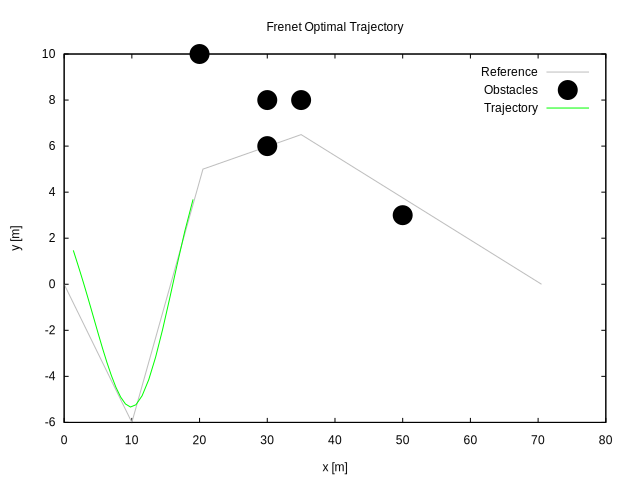

Optimal trajectory planning in Frenet coordinate frame. Widely used in autonomous driving for lane keeping and obstacle avoidance.

Gray: Reference path, Green: Optimal trajectory, Black: Obstacles, Red: Vehicle

- [src](./crates/rust_robotics_planning/src/frenet_optimal_trajectory.rs)

```
cargo run -p rust_robotics --example frenet_optimal_trajectory
```

## State Lattice Planner

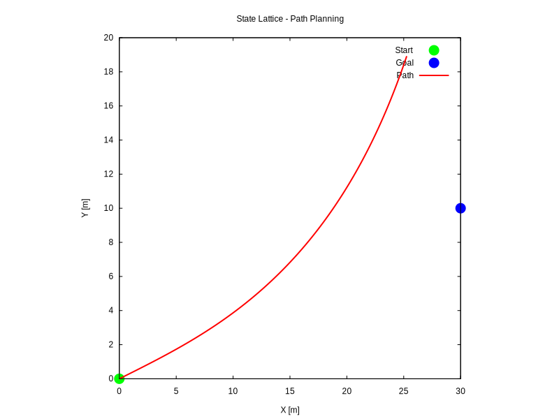

Lattice-based motion planning that searches over a pre-computed set of motion primitives. Generates smooth, dynamically feasible trajectories by connecting state lattice primitives.

- [src](./crates/rust_robotics_planning/src/state_lattice/)

```
cargo run -p rust_robotics --example state_lattice
```

# Path Tracking

## LQR Steer Control

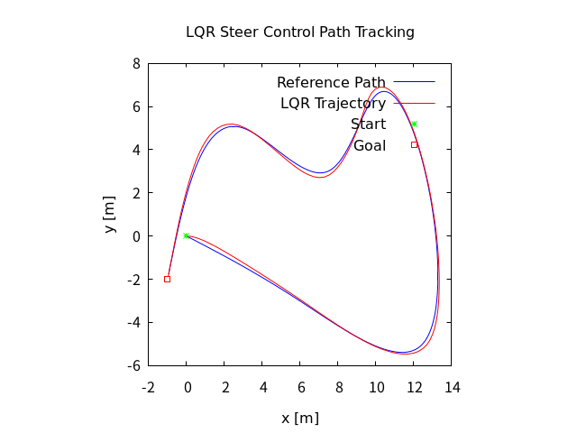

Black: Planned path, Green: Tracked path

- [src](./crates/rust_robotics_control/src/lqr_steer_control.rs)

```
cargo run -p rust_robotics --example lqr_steer_control
```

## Move to Pose

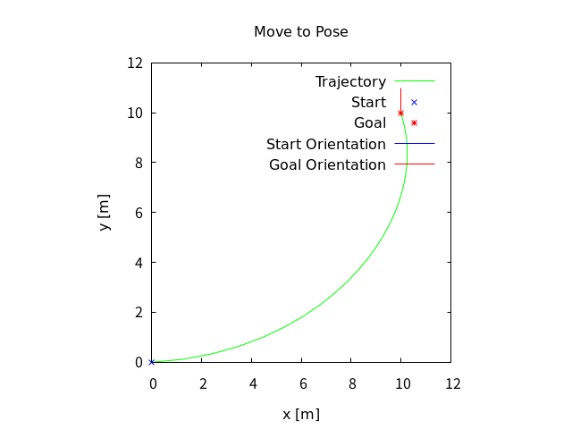

Green: Path, Red: Start and Goal

- [src](./crates/rust_robotics_control/src/move_to_pose.rs)

```
cargo run -p rust_robotics --example move_to_pose
```

## Pure Pursuit

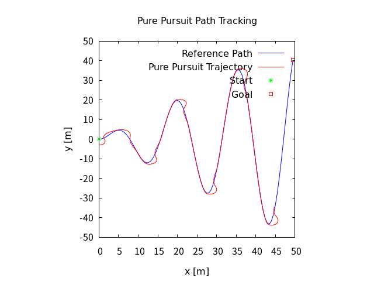

Black: Planned path, Green: Tracked path

- [src](./crates/rust_robotics_control/src/pure_pursuit.rs)

```
cargo run -p rust_robotics --example pure_pursuit
```

## Stanley Control

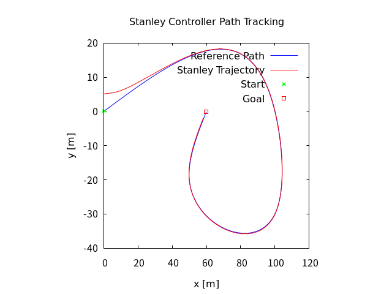

Black: Planned path, Green: Tracked path

- [src](./crates/rust_robotics_control/src/stanley_controller.rs)

```
cargo run -p rust_robotics --example stanley_controller
```

## Rear Wheel Feedback Control

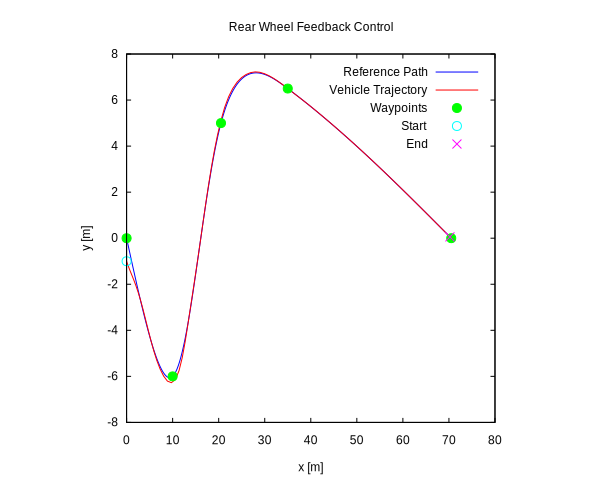

Path tracking using rear wheel feedback steering control. Combines heading error and lateral error with path curvature feedforward.

Blue: Reference path, Red: Vehicle trajectory, Green: Waypoints

- [src](./crates/rust_robotics_control/src/rear_wheel_feedback.rs)

```
cargo run -p rust_robotics --example rear_wheel_feedback
```

## MPC (Model Predictive Control)

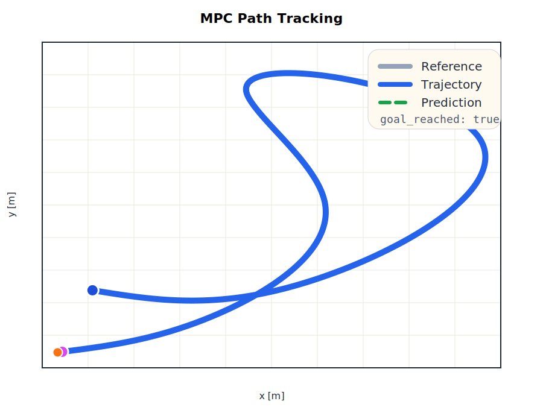

Model Predictive Control for path tracking using linearized bicycle model. Predicts future states and optimizes control inputs over a horizon.

Gray: Reference path, Blue: Tracked trajectory, Green: Prediction horizon, Red: Vehicle

- [src](./crates/rust_robotics_control/src/mpc.rs)

```
cargo run -p rust_robotics --example mpc
```

# Inverted Pendulum

## LQR Control

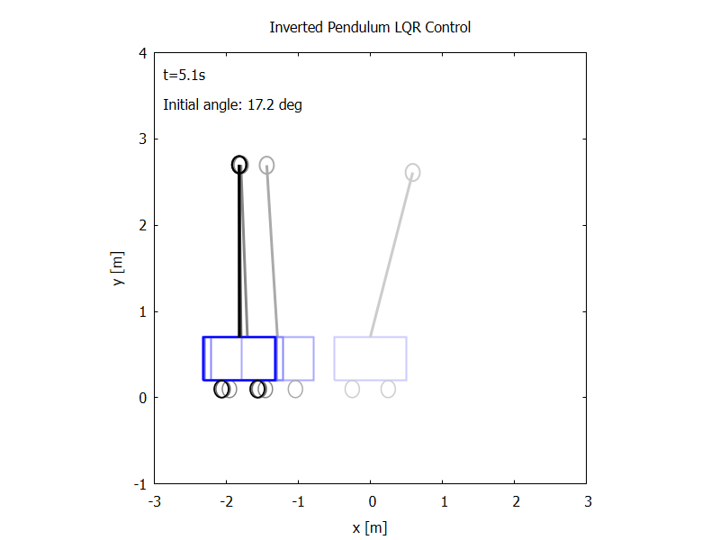

Cart-pendulum animation showing LQR control stabilization. Blue: Cart, Black: Pendulum. Multiple frames overlaid to show time progression from initial angle to stabilized state.

- [src](./crates/rust_robotics_control/src/lqr_control.rs)

```
cargo run -p rust_robotics --example inverted_pendulum_lqr
```

# Arm Navigation

## Two Joint Arm Control

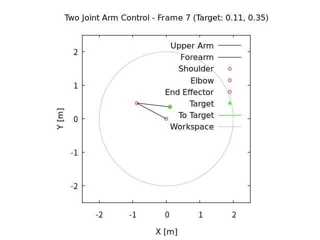

Two joint arm to a point control simulation using inverse kinematics.

Black: Arm links, Red: Joints (shoulder, elbow, end effector), Green: Target position

- [src](./crates/rust_robotics_control/src/two_joint_arm_control.rs)

```
cargo run -p rust_robotics --example two_joint_arm_control
```

# Aerial Navigation

## 3D Grid A*

Bounded 3D voxel-grid planning for aerial robots. The planner supports 6-connected or 26-connected motion and returns a collision-free waypoint sequence.

- [src](./crates/rust_robotics_planning/src/grid_a_star_3d.rs)

```
cargo run -p rust_robotics --example grid_a_star_3d
```

# Mission Planning

## Behavior Tree

Behavior tree runtime for mission-level decision making with sequence, selector, condition, and action nodes backed by a shared blackboard.

- [src](./crates/rust_robotics_control/src/behavior_tree.rs)

```
cargo run -p rust_robotics --example behavior_tree
```

## State Machine

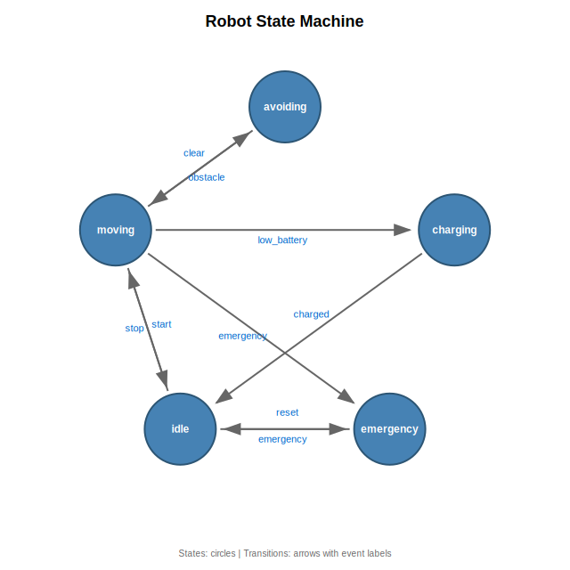

Finite state machine for robot behavior management with states, transitions, guards, and actions

- [src](./crates/rust_robotics_control/src/state_machine.rs)

```
cargo run -p rust_robotics --example state_machine
```
