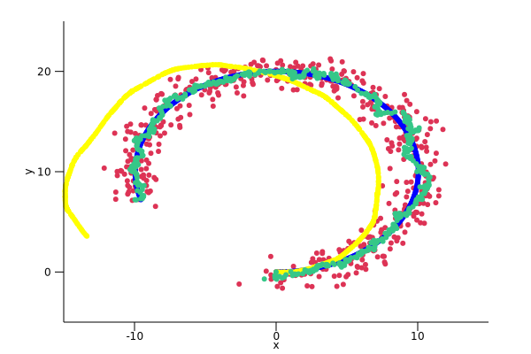
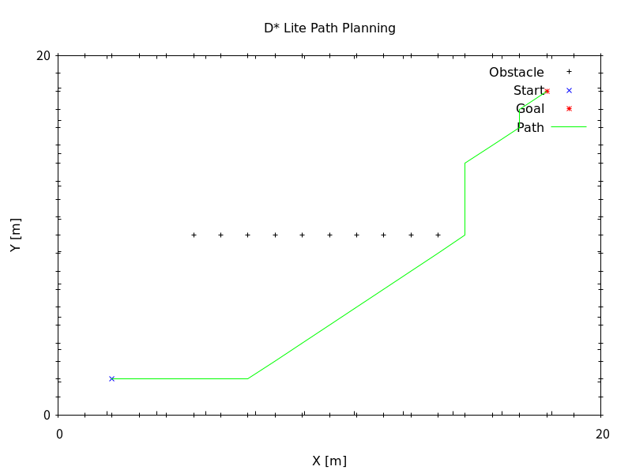
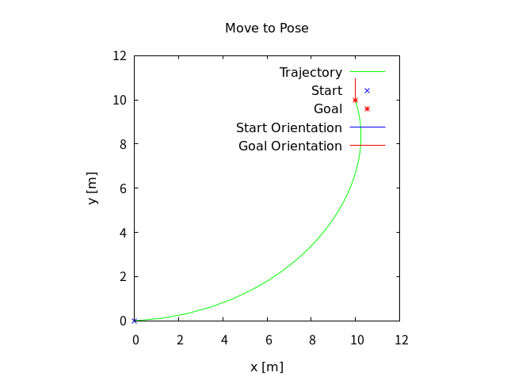
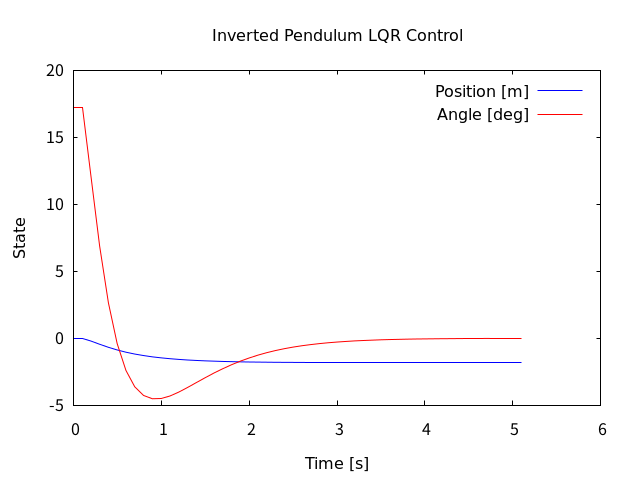

RustRobotics
====

This package is a rust implementation of [PythonRobotics](https://github.com/AtsushiSakai/PythonRobotics).

Build
```
git clone https://github.com/rsasaki0109/RustRobotics.git
cd RustRobotics
cargo build
```

Run (Example)
```
cargo run --bin a_star
cargo run --bin rrt
cargo run --bin inverted_pendulum_lqr
cargo run --bin two_joint_arm_control
```

# Table of Contents
   * [Localization](#localization)
      * [Extended Kalman Filter Localization](#extended-kalman-filter-localization)
      * [Particle Filter Localization](#particle-filter-localization)
      * [Unscented Kalman Filter Localization](#unscented-kalman-filter-localization)
      * [Histogram Filter Localization](#histogram-filter-localization)
   * [Mapping](#mapping)
      * [NDT Map](#ndt-map)
      * [Gaussian Grid Map](#gaussian-grid-map)
      * [Ray Casting Grid Map](#ray-casting-grid-map)
   * [SLAM](#slam)
      * [Iterative Closest Point](#iterative-closest-point-icp-matching)
      * [FastSLAM 1.0](#fastslam-10)
   * [Path Planning](#path-planning)
      * [A* Algorithm](#a-algorithm)
      * [Bezier Path Planning](#bezier-path-planning)
      * [Cubic Spline](#cubic-spline)
      * [D* Lite](#d-lite)
      * [Dynamic Window Approach](#dynamic-window-approach)
      * [Dijkstra Algorithm](#dijkstra-algorithm)
      * [Informed RRT*](#informed-rrt)
      * [Model Predictive Trajectory Generator](#model-predictive-trajectory-generator)
      * [Potential Field Algorithm](#potential-field-algorithm)
      * [Quintic Polynomials](#quintic-polynomials)
      * [Rapidly-Exploring Random Trees (RRT)](#rapidly-exploring-random-trees-rrt)
      * [RRT*](#rrt)
      * [Reeds-Shepp Path](#reeds-shepp-path)
      * [PRM (Probabilistic Road-Map)](#prm-probabilistic-road-map)
      * [Voronoi Road-Map](#voronoi-road-map)
      * [Frenet Optimal Trajectory](#frenet-optimal-trajectory)
   * [Path Tracking](#path-tracking)
      * [LQR Steer Control](#lqr-steer-control)
      * [Move to Pose](#move-to-pose)
      * [Pure Pursuit](#pure-pursuit)
      * [Stanley Control](#stanley-control)
      * [MPC (Model Predictive Control)](#mpc-model-predictive-control)
   * [Inverted Pendulum](#inverted-pendulum)
      * [LQR Control](#lqr-control)
   * [Arm Navigation](#arm-navigation)
      * [Two Joint Arm Control](#two-joint-arm-control)

# Localization
## Extended Kalman Filter Localization




Red:GPS, Brue:Ground Truth, Green:EKF, Yellow:Dead Reckoning

- [src](https://github.com/rsasaki0109/RustRobotics/blob/master/src/bin/ekf.rs)

```
cargo run --bin ekf
```

## Particle Filter Localization


Blue: GPS, Red: Ground Truth, Green: Particle Filter, Yellow: Dead Reckoning

- [src](./src/localization/particle_filter.rs)

```
cargo run --bin particle_filter
```

## Unscented Kalman Filter Localization


Blue: Ground Truth, Red: UKF Estimate, Black: Dead Reckoning, Green: GPS Observations, Red Ellipse: Uncertainty

- [src](./src/localization/unscented_kalman_filter.rs)

```
cargo run --bin unscented_kalman_filter
```

## Histogram Filter Localization


Grid-based probabilistic localization using RFID landmarks. The algorithm maintains a probability distribution over a 2D grid and updates it based on motion and observations.

Blue: True path, Yellow: Dead Reckoning, Green: Histogram Filter estimate, Black: RFID landmarks

- [src](./src/localization/histogram_filter.rs)

```
cargo run --bin histogram_filter
```

# Mapping
## NDT Map


- [src](./src/mapping/ndt.rs)

```
cargo run --bin ndt
```

## Gaussian Grid Map


Occupancy grid mapping using Gaussian distribution. Higher probability near obstacles.

- [src](./src/mapping/gaussian_grid_map.rs)

```
cargo run --bin gaussian_grid_map
```

## Ray Casting Grid Map


Occupancy grid mapping using ray casting. Free space (0.5), Occupied (1.0), Unknown (0.0).

- [src](./src/mapping/ray_casting_grid_map.rs)

```
cargo run --bin ray_casting_grid_map
```

# SLAM

## Iterative Closest Point (ICP) Matching


Red: Reference points, Blue: Initial points, Green: Aligned points

- [src](./src/slam/icp_matching.rs)

```
cargo run --bin icp_matching
```

## FastSLAM 1.0


Particle filter based SLAM (Simultaneous Localization and Mapping). Each particle maintains its own map of landmarks using EKF.

Blue: True path, Yellow: Dead Reckoning, Green: FastSLAM estimate, Black: True landmarks, Cyan: Estimated landmarks

- [src](./src/slam/fastslam1.rs)

```
cargo run --bin fastslam1
```

# Path Planning

## A* Algorithm


Blue: Start, Red: Goal, Green: Path, Gray: Obstacles

- [src](./src/path_planning/a_star.rs)

```
cargo run --bin a_star
```

## Bezier Path Planning


Blue: Start, Red: Goal, Green: Path

- [src](./src/path_planning/bezier_path_planning.rs)

```
cargo run --bin bezier_path_planning
```

## Cubic Spline


Black: Control points, Green: Path

- [src](./src/path_planning/csp.rs)

```
cargo run --bin csp
```

## Dynamic Window Approach


Black: Obstacles, Green: Trajectory, Yellow: Predicted trajectory

- [src](./src/path_planning/dwa.rs)

```
cargo run --bin dwa
```

## D* Lite



Blue: Start, Red: Goal, Green: Path, Black: Obstacles

- [src](./src/path_planning/d_star_lite.rs)

```bash
cargo run --bin d_star_lite
```

D* Lite is an incremental heuristic search algorithm for path planning in dynamic environments. It's particularly efficient for replanning when the environment changes.

## Dijkstra Algorithm


- [src](./src/path_planning/dijkstra.rs)

```
cargo run --bin dijkstra
```

## Informed RRT*


Blue: Start, Red: Goal, Green: Path, Black: Tree

- [src](./src/path_planning/informed_rrt_star.rs)

```
cargo run --bin informed_rrt_star
```

## Model Predictive Trajectory Generator


Green: Path

- [src](./src/path_tracking/model_predictive_trajectory_generator.rs)

```
cargo run --bin model_predictive_trajectory_generator
```

## Potential Field Algorithm


Blue: Start, Red: Goal, Green: Path, Gray: Obstacles

- [src](./src/path_planning/potential_field.rs)

```
cargo run --bin potential_field
```

## Quintic Polynomials


Blue: Start, Red: Goal, Green: Path

- [src](./src/path_planning/quintic_polynomials.rs)

```
cargo run --bin quintic_polynomials
```

## Rapidly-Exploring Random Trees (RRT)


Blue: Start, Red: Goal, Green: Path, Black: Tree

- [src](./src/path_planning/rrt.rs)

```
cargo run --bin rrt
```

## RRT*


Blue: Start, Red: Goal, Green: Path, Black: Tree

- [src](./src/path_planning/rrt_star.rs)

```
cargo run --bin rrt_star
```

## Reeds-Shepp Path


Blue: Start, Red: Goal, Green: Path

- [src](./src/path_planning/reeds_shepp_path.rs)

```
cargo run --bin reeds_shepp_path
```

## State Lattice Planner

## PRM (Probabilistic Road-Map)


Sampling-based path planning using random samples and k-nearest neighbor connections.

Blue: Start, Red: Goal, Green: Path, Gray: Samples and edges, Black: Obstacles

- [src](./src/path_planning/prm.rs)

```
cargo run --bin prm
```

## Voronoi Road-Map


Path planning using Voronoi diagram vertices as waypoints. Provides paths that maximize clearance from obstacles.

Blue: Start, Red: Goal, Green: Path, Cyan: Voronoi vertices, Black: Obstacles

- [src](./src/path_planning/voronoi_road_map.rs)

```
cargo run --bin voronoi_road_map
```

## Frenet Optimal Trajectory


Optimal trajectory planning in Frenet coordinate frame. Widely used in autonomous driving for lane keeping and obstacle avoidance.

Gray: Reference path, Green: Optimal trajectory, Black: Obstacles, Red: Vehicle

- [src](./src/path_planning/frenet_optimal_trajectory.rs)

```
cargo run --bin frenet_optimal_trajectory
```

# Path Tracking

## LQR Steer Control


Black: Planned path, Green: Tracked path

- [src](./src/path_tracking/lqr_steer_control.rs)

```
cargo run --bin lqr_steer_control
```

## Move to Pose



Green: Path, Red: Start and Goal

- [src](./src/path_tracking/move_to_pose.rs)

```
cargo run --bin move_to_pose
```

## Pure Pursuit


Black: Planned path, Green: Tracked path

- [src](./src/path_tracking/pure_pursuit.rs)

```
cargo run --bin pure_pursuit
```

## Stanley Control


Black: Planned path, Green: Tracked path

- [src](./src/path_tracking/stanley_controller.rs)

```
cargo run --bin stanley_controller
```

## Nonlinear Model predictive control with C-GMRES

## MPC (Model Predictive Control)


Model Predictive Control for path tracking using linearized bicycle model. Predicts future states and optimizes control inputs over a horizon.

Gray: Reference path, Blue: Tracked trajectory, Green: Prediction horizon, Red: Vehicle

- [src](./src/path_tracking/mpc.rs)

```
cargo run --bin mpc
```

# Inverted Pendulum

## LQR Control



Blue: Position, Red: Angle

- [src](./src/inverted_pendulum/lqr_control.rs)

```
cargo run --bin inverted_pendulum_lqr
```

# Arm Navigation

## Two Joint Arm Control


Blue: Theta1, Red: Theta2 joint angles over time

- [src](./src/arm_navigation/two_joint_arm_control.rs)

```
cargo run --bin two_joint_arm_control
```

# Mission Planning

## State Machine


Finite state machine for robot behavior management with states, transitions, guards, and actions

- [src](./src/mission_planning/state_machine.rs)

```
cargo run --bin state_machine
```


