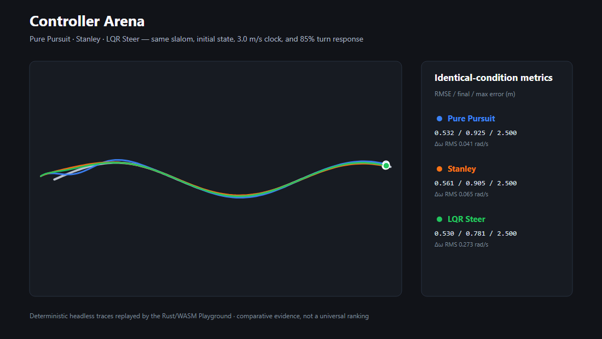

# rust_robotics_playground

Interactive browser-ready demos for RustRobotics algorithms. This crate is
**not** published to crates.io; it ships with the repository for local debug
and GitHub Pages deployment.

## Run locally (native)

```bash
cargo run -p rust_robotics_playground
```

## Run in the browser (WASM)

Install [Trunk](https://trunkrs.dev/) and serve from this directory:

```bash
rustup target add wasm32-unknown-unknown
cd crates/rust_robotics_playground
RUSTFLAGS='--cfg getrandom_backend="wasm_js"' trunk serve --public-url /
```

Release build (matches GitHub Pages):

```bash
RUSTFLAGS='--cfg getrandom_backend="wasm_js"' trunk build --release --public-url /rust_robotics/playground/
```

Live demo: https://rsasaki0109.github.io/rust_robotics/playground/

## Reproducible links

Use **Copy share link** in the header to copy a URL for the active demo. Grid
planner links preserve the selected planner, start and goal cells, and the full
obstacle map. Controller Arena links preserve the path preset, target speed,
and turn-response disturbance. For example,
`?tab=arena&preset=hairpin&speed=4.25&response=0.65` reopens an identical
three-controller comparison. Localization, SLAM, and ADMM links currently
preserve the selected tab.

## Tabs

- **Grid Planners** — A\*, Dijkstra, JPS, Theta\* with click-to-edit obstacles.
- **Localization** — PF / EKF with arrow-key driving and noise slider.
- **SLAM** — EKF-SLAM, FastSLAM 1.0, ICP scan matching on a canned loop (timeline scrubber).
- **ADMM Formation** — receding-horizon consensus ADMM with four agents past an L-corner.
- **Controller Arena** — precomputed, deterministic Pure Pursuit / Stanley /
  LQR Steer traces under identical paths and dynamics. Compare cross-track
  RMSE, final and maximum error, and angular-command smoothness; replay, pause,
  single-step, or share the scenario.

Controller Arena does not declare a universal winner. Its three presets and
bounded speed/turn-response controls make differences visible while keeping
the state, clock, propagation model, and limits identical for every controller.



Regenerate the gallery comparison from the same headless engine:

```bash
cargo run -p rust_robotics --example render_controller_arena_svg \
  --no-default-features --features control
```
