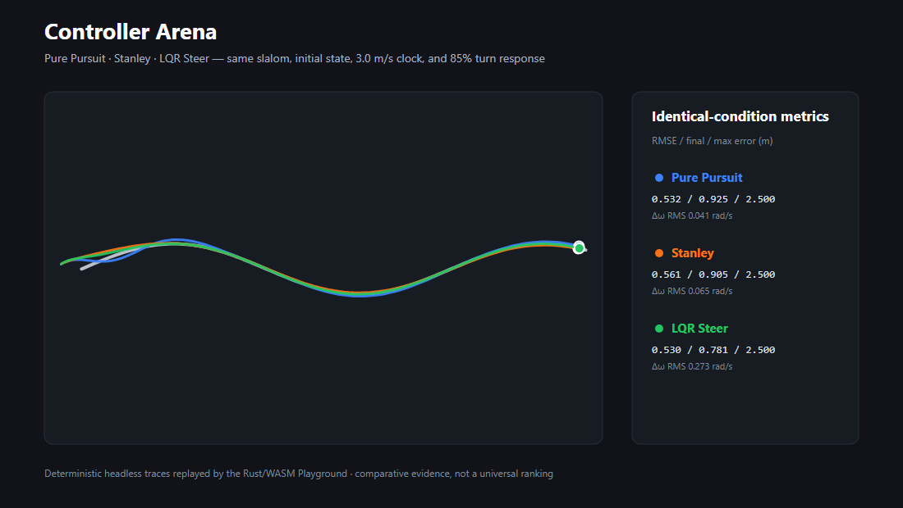

# rust_robotics_playground

Interactive browser-ready demos for RustRobotics algorithms. This crate is
**not** published to crates.io; it ships with the repository for local debug
and GitHub Pages deployment.

## Run locally (native)

```bash
cargo run -p rust_robotics_playground
```

## Run in the browser (WASM)

Install [Trunk](https://trunkrs.dev/) and serve from this directory:

```bash
rustup target add wasm32-unknown-unknown
cd crates/rust_robotics_playground
RUSTFLAGS='--cfg getrandom_backend="wasm_js"' trunk serve --public-url /
```

Release build (matches GitHub Pages):

```bash
RUSTFLAGS='--cfg getrandom_backend="wasm_js"' trunk build --release --public-url /rust_robotics/playground/
```

Live demo: https://rsasaki0109.github.io/rust_robotics/playground/

## First visit and saved experiments

New browser visitors see a 30-second mission that runs all four grid planners
on the same map and saves the result as a reproducible URL. The playground
stores at most five recent experiments and the last saved configuration in the
browser's local storage; no account is required and this data is not sent by
the playground.

All tabs encode their important configuration in share links:

- Grid Planners: planner, endpoints, and obstacle map
- Localization: filter and measurement-noise scale
- SLAM: algorithm, timeline frame, and playback state
- ADMM Formation: noise, visible runs, timeline frame, and playback state
- Controller Arena: path preset, target speed, and turn response

## Engagement event hooks

The WASM app emits DOM events without making network requests. A Pages-level
analytics integration can subscribe to events prefixed with
`rust-robotics:`, including `playground_loaded`, `preset_started`,
`experiment_completed`, `onboarding_completed`, `share_link_copied`, and
`returning_experiment_resumed`. This keeps analytics optional and separates it
from the robotics code.

## Reproducible links

Use **Copy share link** in the header to copy a URL for the active demo. Grid
planner links preserve the selected planner, start and goal cells, and the full
obstacle map. Controller Arena links preserve the path preset, target speed,
and turn-response disturbance. For example,
`?tab=arena&preset=hairpin&speed=4.25&response=0.65` reopens an identical
three-controller comparison. Localization, SLAM, and ADMM links currently
preserve the selected tab.

## Tabs

- **Grid Planners** — A\*, Dijkstra, JPS, Theta\* with click-to-edit obstacles.
- **Localization** — PF / EKF with arrow-key driving and noise slider.
- **SLAM** — EKF-SLAM, FastSLAM 1.0, ICP scan matching on a canned loop, and
  **LiDAR loop closure** (scan-to-map + pose graph on a corridor loop; toggle the
  map between front-end and loop-closed poses) with a timeline scrubber, plus
  **Drive LiDAR SLAM**: arrow-key (or auto) driving with live scan-to-map and
  loop closure, and sliders for odometry scale error, yaw drift, and range noise.
  Pick a world preset (corridor loop / pillar hall / empty box) and drag on the
  map to add walls; presets and drawn walls round-trip through share links.
  The node scans feed a log-odds occupancy grid (toggle the overlay); click the
  map to set a goal and the robot plans with A\* on that grid and follows the
  path with Pure Pursuit from its SLAM estimate, replanning as the map grows.
  **Kidnap robot** freezes the map, teleports the robot to a random free spot,
  and localizes it with likelihood-field MCL (yellow particles; the gray robot
  is the ground truth) — kidnap it again to watch the filter recover. Drive
  with the arrow keys or the on-screen joystick (touch screens). **Explore
  (frontiers)** drives to the nearest reachable boundary between known free
  and unknown space (orange) until the map is complete. **Moving people**
  are seen by the LiDAR but not in the map; when the next second of the Pure
  Pursuit arc would hit something, DWA picks a collision-free arc (yellow).
  **Ignore moving objects** keeps their scan points (purple) out of scan
  matching and the map; untick it to watch them drag the SLAM estimate.
  Loop checks and re-optimization are spread over frames so driving stays
  smooth. On phones the header collapses to a tab menu and the page scrolls.
- **ADMM Formation** — receding-horizon consensus ADMM with four agents past an L-corner.
- **Pushing** — quasi-static pusher-slider with face-switching MPPI: drag or turn
  the goal pose, click obstacles in or out, change the pusher friction, and watch
  the contact stick (yellow) or slide (orange). Presets for translation, a pure
  90° turn, and sideways motion; goal, friction, and obstacles round-trip
  through share links.
- **Controller Arena** — precomputed, deterministic Pure Pursuit / Stanley /
  LQR Steer traces under identical paths and dynamics. Compare cross-track
  RMSE, final and maximum error, and angular-command smoothness; replay, pause,
  single-step, or share the scenario.

Controller Arena does not declare a universal winner. Its three presets and
bounded speed/turn-response controls make differences visible while keeping
the state, clock, propagation model, and limits identical for every controller.



Regenerate the gallery comparison from the same headless engine:

```bash
cargo run -p rust_robotics --example render_controller_arena_svg \
  --no-default-features --features control
```
